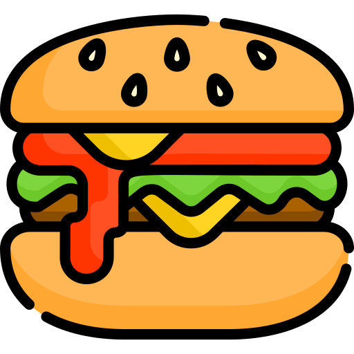

<p align="center">
  <a href="#">
    
  </a>
</p>
<h1 align="center">Vue Burger</h1>
<p align="center">Vue.js plugin for <a href="https://github.com/jonsuh/hamburgers">Tasty CSS-animated hamburgers</a></p>

## About

Vue Burger is a Vue component/plugin that is a wrapper around [Tasty CSS-animated hamburgers](https://github.com/jonsuh/hamburgers), wellknown css library for hamburger icons. 

## Installation

```
npm install vue-burger
# or
yarn add vue-burger
```

## Initialization

```js
import App from './App.vue';
import VBurger from 'vue-burger';
import Vue from 'vue';

Vue.use(VBurger);

new Vue({
  render: h => h(App),
}).$mount('#app');
```

`VBurger` component can be used in without plugin initialization:
```vue
<template>
  <v-burger/>
</template>

<script>
import { VBurger } from 'vue-burger';

export default { 
  component: {
    VBurger
  }
}
</script>
```

## Usage

```vue
<template>
  <v-burger type="arrow" />
</template>
```

### Props

### type
  -  type: `String`, 
  -  default: 'boring'
### burgerStyle
  -  type: `Object`, 
  -  default: `{}`
### ariaLabel
  -  type: `String`, 
  -  default: 'Menu'
### ariaControls
  -  type: `String`, 
  -  default: 'navigation'
### tabIndex
  -  type: `Number`, 
  -  default: `0` 

### Types of burger
Available types are: 

- 3dx,
- 3dx-r,
- 3dy,
- 3dy-r,
- 3dxy,
- 3dxy-r,
- arrow,
- arrow-r,
- arrowalt,
- arrowalt-r,
- arrowturn,
- arrowturn-r,
- boring,
- collapse,
- collapse-r,
- elastic,
- elastic-r,
- emphatic,
- emphatic-r,
- minus,
- slider,
- slider-r,
- spring,
- spring-r,
- stand,
- stand-r,
- spin,
- spin-r,
- squeeze,
- vortex,
- vortex-r

You can see all the types in actions on official documentation for [Hamburgers](https://jonsuh.com/hamburgers/).

### Styling the burger

For styling regular CSS variables are used. Variables are defined 
in `burgerStyle` prop. Available variables:

| Variable                  | Description                                 | Default value      |
| ------------------------- | ------------------------------------------- | ------------------ |
| `--padding`               | padding of the hamburger box                | 15px               |
| `--bg-color`              | hamburger background color                  | transparent        |
| `--box-width`             | hamburger box width                         | 40px               |
| `--box-height`            | hamburger box height                        | 24px               |
| `--layer-width`           | width of each hamburger layer               | 40px               |
| `--layer-height`          | height of each hamburger layer              | 4px                |
| `--layer-bg-color`        | layer background color                      | #000000            |
| `--active-layer-bg-color` | layer background color when in active state | `--layer-bg-color` |

Example: 
```vue
<template>
  <v-burger 
    :type="arrow" 
    :burgerStyle="burgerStyle">
  </v-burger>
</template>

<script>
  export default {
    data() {
      return {
        burgerStyle: {
          '--padding': '10px',
          '--layer-bg-color': 'yellow',
          '--active-layer-bg-color': '#ABABAB',
          '--layer-width': '20px',
        }
      }
    }
  }
</script>
```

### Slots 
Burger has one named slot for setting label for accessability [as suggested by Hamburgers author.](https://github.com/jonsuh/hamburgers#accessibility)

| Slot    | Description    |
| ------- | -------------- |
| `label` | label for a11y |

Example: 

```vue
  <v-burger>
    <template v-slot:label>
      <span class="hamburger-label">Menu</span>
    </template>
  </v-burger>
```

### Events

Burger components emits `updated` event that exposes the active state. It fires after the burger button is clicked. Check the [example](https://github.com/zcuric/vue-burger/blob/master/example/App.vue) for usage.

| Event     | Description                              | Params           |
| --------- | ---------------------------------------- | ---------------- |
| `updated` | fired after the burger button is clicked | active (Boolean) |

Example with sync modifier:

```vue
  <v-burger 
    @update="isActive = $emit
  </v-burger>
```

## Development

```
# Running examples
npm run serve

# Running tests
npm run test

# Running build
npm run build
```

## Contributing

All contributions are welcome.

## License

MIT @ Zdravko Ćurić [(zcuric)](https://github.com/zcuric)

_Icon made by  [Freepik](https://www.flaticon.com/authors/freepik) from [flaticon](https://www.flaticon.com/)._
